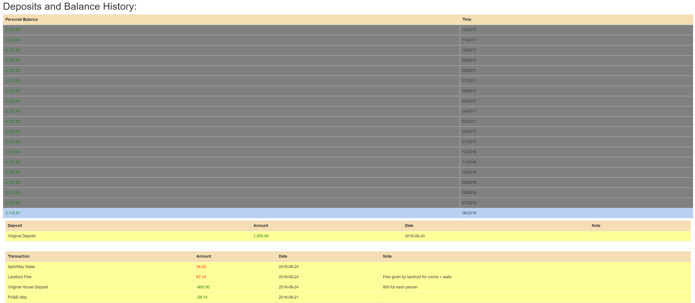

# House Banking System

## Overview
Allows users to record transactions and bank deposits in order to keep track of finance for a group of people. Features: multiple users, recording metadata about transactions and deposits, view personal and global balance and transactions, bulletin board allowing people to post notes, administrator privilege (including the ability to record transactions for others), encrypted password login protection and email recovery mechanism.

## Technical Description
A MVC LAMP web application. Frontend uses mostly JQuery, soome AJAX (for the bulletin), and Bootstrap. Hosted on [Heroku](https://morning-ravine-1519.herokuapp.com).

## Demos

These screenshots were taken from a logged-in user.

### Home

This page serves as a bulletin board of some sorts and also displays the overall balance of the entire house.

### Balance

This page allows users to record deposits and transactions made. 

On the bottom is the user's monthly balance (can click to be expanded if there has been activity in that month).

